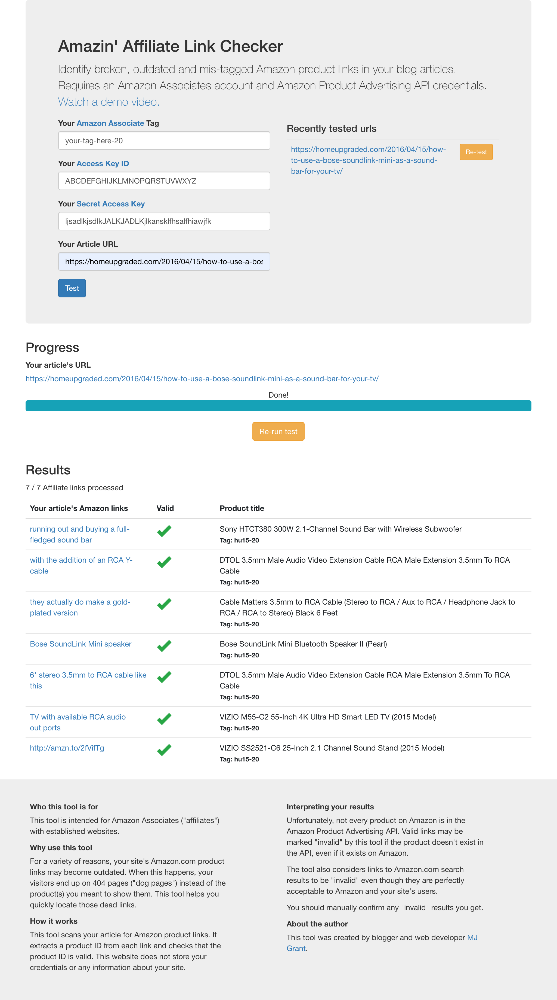

# amazin-link-checker



This github repo contains the tool's codebase and is made public as an example of my work. You can use the tool without cloning this repo by visiting it at (URL coming soon). 

## Who this tool is for
This tool is intended for Amazon Associates ("affiliates") with established websites.

## Why use this tool
For a variety of reasons, your site's Amazon.com product links may become outdated. When this happens, your visitors end up on 404 pages ("dog pages") instead of the product(s) you meant to show them. This tool helps you quickly locate those dead links.

## How it works
This tool scans your article for Amazon product links. It extracts a product ID from each link and checks that the product ID is valid. This website does not store your credentials or anything about your site.

## Interpreting your results
Unfortunately, not every product on Amazon is in the Amazon Product Advertising API. Valid links may be marked "invalid" by this tool if the product doesn't exist in the API. The tool also considers links to Amazon.com search results to be "invalid" even though they are perfectly acceptable to Amazon and your site's users. You should manually confirm any "invalid" results you get.

## To run locally:

1. Clone both this repo (the client) and the [server repo](https://github.com/MJGrant/amazin-link-checker-server)
2. Open a terminal window for each repo
3. In server, ```npm install``` and ```node app.js```
4. In client, ```npm install``` and ```npm start```
5. In your browser go to ```localhost:3001```

### Running tests

From the **server** directory: 

```nightwatch frontend.js``` runs integration tests

From the **client** directory:

```npm run test-u``` rebuilds snapshots and runs unit tests

```npm run test``` runs unit tests on existing snapshots

## Want to make it better?
Make a pull request and I'll check it out!

## About me

I'm a Chicago-based web developer who thought it might be fun to automate the tedious process of hunting outdated Amazon links on my blog.
